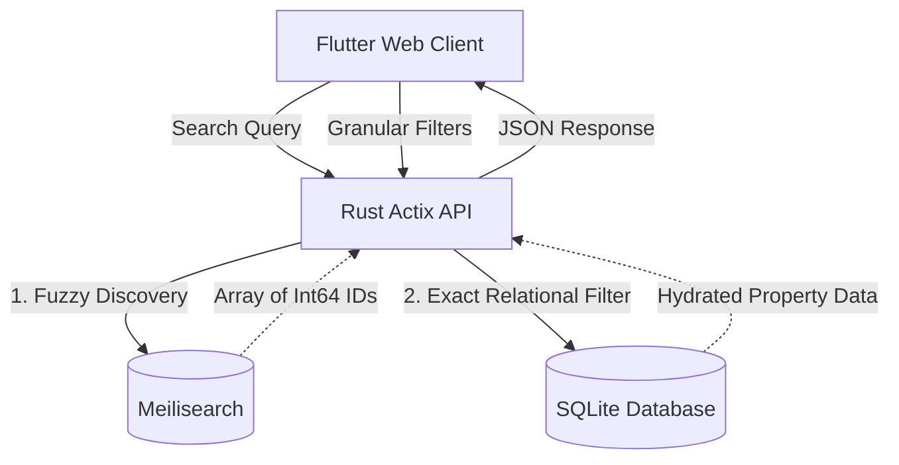

<div align="center">
  <h1>🏢 Tokenized Real Estate Engine</h1>
  <p><strong>A high-performance, dual-layer search and ingestion engine for tokenized global real estate.</strong></p>

  [](https://www.rust-lang.org)
  [](https://flutter.dev)
  [](https://www.meilisearch.com/)
  [](https://www.sqlite.org/)
</div>

<hr />

## 📖 Overview

The **Tokenized Real Estate Engine** is a production-grade backend and frontend solution designed to solve complex querying and ingestion requirements for fractionalized real estate assets. It elegantly handles the dichotomy between **fuzzy full-text discovery** (handling misspellings and location matching) and **exhaustive relational filtering** (handling strict price boundaries and property enums).

By separating concerns into a **Discovery Layer (Meilisearch)** and an **Exhaustive Data Layer (SQLite)**, the platform guarantees sub-15ms search latencies while maintaining strict data integrity and zero-leak geographical constraints.

---

## ✨ Key Features

- **🚀 Dual-Tiered Architecture:** Blistering fast search resolution using Meilisearch, paired with the relational robustness of SQLite (WAL mode) for exact-match numerical filtering.
- **🌍 IP / Country Context Boosting:** Smart search that prioritizes local inventory based on the user's origin (e.g., matching "Marina" to *Dubai Marina* for UAE users, or *Marina Bay* for SG users).
- **🔒 Secure Ingestion Pipeline:** An authenticated admin API with dynamic IP whitelist resolution capabilities to safely onboard high-value asset metadata.
- **📱 Flutter Web Client:** A premium, interactive frontend complete with a responsive search bar, custom UI drop-downs, and an interactive **Yield Calculator** for real-time ROI forecasting.
- **📖 Interactive API Docs:** Fully integrated OpenAPI/Swagger UI endpoint (`/swagger-ui`) built directly into the Rust backend via `utoipa`.
- **🕵️ Strict "Zero Leaks":** Enforced backend rules ensuring that explicitly 0-result queries return clean, empty arrays rather than generic fallback data.

---

## 🛠 Tech Stack

### **Backend Core**
- **Rust (Actix-web)** - Highly concurrent, safe, and wildly fast HTTP server.
- **SQLite (sqlx)** - Asynchronous, connection-pooled relational store running in WAL mode.
- **Meilisearch** - Dedicated external search cluster for typo-tolerant index resolution.
- **Utoipa** - Compile-time OpenAPI schema generation and Swagger UI serving.

### **Frontend Client**
- **Flutter (Web Target)** - Single-codebase framework for crafting beautiful, responsive UIs.
- **Dart** - Fast, object-oriented language for client-side state and logic.

---

## 🏗 System Architecture



---

## 🚀 Getting Started

### Prerequisites
- [Rust & Cargo](https://rustup.rs/) (v1.75+)
- [Flutter SDK](https://docs.flutter.dev/get-started/install) (v3.19+)
- [Meilisearch Binary](https://github.com/meilisearch/meilisearch/releases) (For local testing, placed in project root)

### 1. Start the Services

To spin up the entire backend stack (including database migrations, seed data, and the Meilisearch sync):

**Windows (PowerShell):**
```powershell
powershell -ExecutionPolicy Bypass -File bootstrap.ps1
```

**macOS / Linux:**
```bash
chmod +x bootstrap.sh
./bootstrap.sh
```

*(Alternatively, run `cargo run` from the `backend/` directory while Meilisearch is running on port 7700).*

### 2. Run the Flutter Frontend

Open a new terminal window, navigate to the frontend directory, and run the web client:

```bash
cd frontend
flutter run -d chrome
```

---

## 📚 API Documentation

Once the backend is running, you can explore the interactive API documentation and test endpoints directly from your browser.

👉 **Swagger UI:** [http://localhost:3000/swagger-ui](http://localhost:3000/swagger-ui)

### Core Endpoints:
- `GET /api/v1/search` — Fuzzy search with optional `country` boosting parameter.
- `GET /api/v1/properties` — Exhaustive filtering array (price, token size, type) using IDs.
- `POST /api/v1/admin/properties` — Secure payload ingestion (Requires `Bearer` token).

---

## 📂 Project Structure

```text
├── backend/                  # Rust server application
│   ├── src/                  # Actix routes, DB queries, Search integration
│   ├── Cargo.toml            # Rust dependencies
│   └── .env                  # Backend environment variables
├── frontend/                 # Flutter web client
│   ├── lib/                  # Screens, UI Components, API Services
│   └── pubspec.yaml          # Flutter dependencies
├── scripts/                  # SQL Migrations & Seed data
│   ├── migrate.sql           # Schema definitions
│   └── seed.sql              # Global real estate mock data
├── ARCH.md                   # Deep-dive architecture design decisions
└── README.md                 # Project documentation
```

---

## 🛡️ License & Acknowledgements

Developed as a rigorous engineering assignment to demonstrate system design, high-speed API routing, frontend/backend integration, and modern search indexing.
